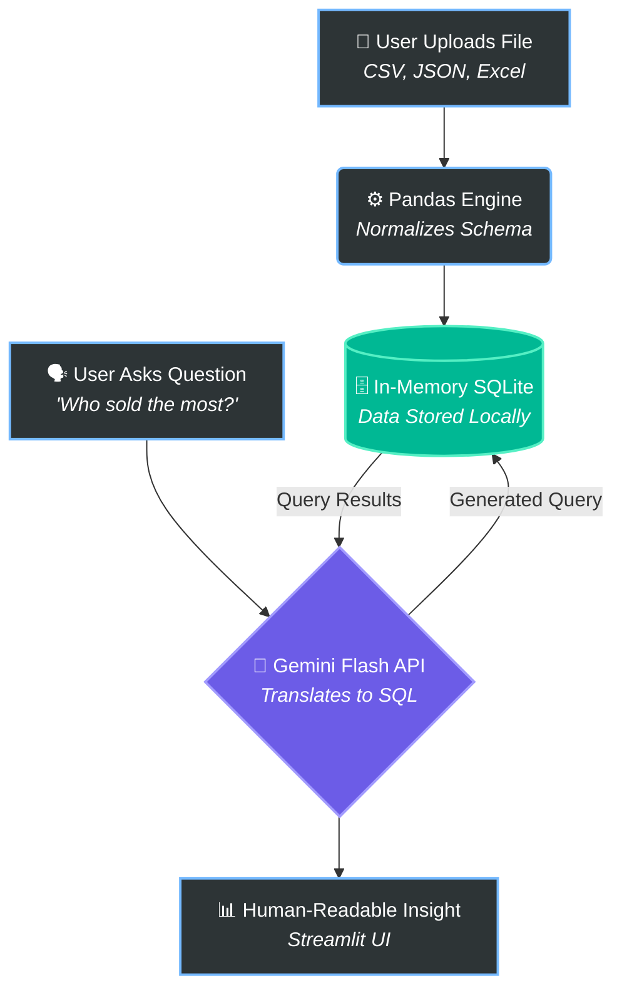

<div align="center">


<h1>🤖 IntelliQuery</h1>

<p>
  <b>Transforming natural language into complex SQL using the cognitive power of Google Gemini.</b>
</p>

<p>
  
  
  
  
</p>

</div>

---

## 🌌 The Vision

**IntelliQuery** is a robust, Streamlit-based cognitive engine designed for Business Analysts and Data Professionals. Upload any structured dataset and query it effortlessly using conversational English. Under the hood, IntelliQuery leverages a highly-resilient REST architecture connected to the **Google Gemini API** to automatically translate your questions into highly accurate SQL queries, execute them, and return human-readable insights.

> **Engineering Note:** This edition is strictly engineered for **Python 3.7 compatibility**. It replaces heavy, modern SDK dependencies with a lightweight, resilient REST architecture utilizing `requests`, complete with automatic retry logic for handling temporary API rate limits or network turbulence.

---

## ⚡ Cognitive Features Matrix

<table align="center">
  <tr>
    <td align="center" width="50%">
      
      <h3>Universal Data Ingestion</h3>
      <p>Upload `.csv`, `.xlsx`, `.json`, `.xml`, and raw `.sql` dumps. The engine dynamically flattens and parses the schema.</p>
    </td>
    <td align="center" width="50%">
      
      <h3>Zero-Code AI Queries</h3>
      <p>Ask questions in plain English. The AI dynamically translates human intent into flawless SQLite `SELECT` operations.</p>
    </td>
  </tr>
  <tr>
    <td align="center">
      
      <h3>Actionable Insights</h3>
      <p>Raw SQL rows are confusing. IntelliQuery feeds the data back into the LLM to summarize the numbers into natural language insights.</p>
    </td>
    <td align="center">
      
      <h3>Resilient Architecture</h3>
      <p>Built-in geometric backoff and auto-retry mechanisms gracefully handle `429` rate limits and Google API downtime.</p>
    </td>
  </tr>
</table>

---

## 🧠 System Architecture

<div align="center">



</div>

---

## 🚀 Ignition Sequence (Setup Guide)

<details>
<summary><b>Click here to view installation & deployment instructions</b></summary>
<br>

### Prerequisites
- **Python 3.7** installed on your system.
- A **Google Gemini API Key** from [Google AI Studio](https://aistudio.google.com/).

### Installation

1. **Clone the repository:**
   ```bash
   git clone https://github.com/TarakShetti/IntelliQuery-Python3.7.git
   cd IntelliQuery-Python3.7
   ```

2. **Initialize Environment:**
   ```bash
   python -m venv venv
   
   # Windows:
   .\venv\Scripts\activate
   
   # macOS/Linux:
   source venv/bin/activate
   ```

3. **Install Dependencies:**
   ```bash
   pip install -r requirements.txt
   ```

### Execution

1. **Inject API Key:**
   ```bash
   # Windows (PowerShell)
   $env:GEMINI_API_KEY="your-api-key-here"
   
   # macOS/Linux
   export GEMINI_API_KEY="your-api-key-here"
   ```

2. **Launch Neural UI:**
   ```bash
   streamlit run app.py
   ```
   *Navigate to `http://localhost:8501` to begin.*

</details>

---

<div align="center">
  <p><i>Democratizing Data Analytics. No SQL required.</i></p>
  
</div>
